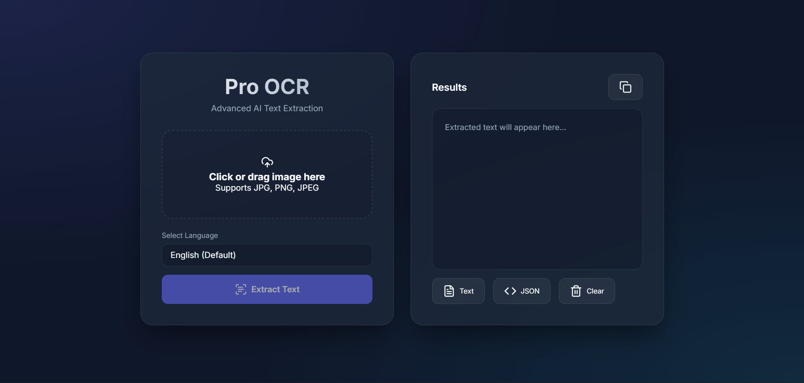

# Pro OCR Solution: Advanced Online and Offline OCR API


**Pro OCR API** is a complete, powerful, and robust Optical Character Recognition (OCR) solution designed to deliver both **Online** and **Offline** text extraction from images. Powered by FastAPI for a high-performance backend, EasyOCR for advanced deep-learning-based offline extraction, and a beautiful, modern, glassmorphism frontend, this tool handles complex language extraction in seconds.

## ✨ Key Features

- **🚀 Dual Mode Support (Offline & Online):** Process text completely offline utilizing EasyOCR with complete privacy, or host the API online to process requests through robust REST endpoints.
- **🌍 Multi-Language Support:** Extracts text in over 8 common languages including:
  - English (Default)
  - Hindi
  - French
  - German
  - Spanish
  - Chinese (Simplified)
  - Japanese
  - Korean
- **🎨 Modern Frontend:** Features a beautiful drag-and-drop web interface with live image previews and sleek, interactive UI components using specialized glass-morphism effects.
- **📥 Multiple Export Options:** Download the extracted outputs as standard `.txt` text or highly structured `.json` data.
- **📋 Copy to Clipboard:** Extracted text can be quickly copied to the clipboard for external use.
- **⚙️ High Performance:** Built on `FastAPI` to execute async file reads, `OpenCV` for speedy image processing and deep learning-based `EasyOCR`.

## 📸 Preview of the Application



<p align="center">
  <em>(A fully responsive frontend interface running on your local container seamlessly taking image inputs and returning extracted text structures)</em>
</p>

## 🛠️ Tech Stack 

- **Backend Context:** Python, `FastAPI`, `Uvicorn`
- **OCR Engine (Offline Extraction):** `EasyOCR`, PyTorch
- **Image Preprocessing:** `OpenCV`, `NumPy`, `Pillow`
- **Frontend Context:** HTML5, CSS3, Vanilla JS, Lucide Icons

## ⚙️ Getting Started

### Prerequisites

You need Python 3.8+ installed on your system.

### 1. Clone the repository

```bash
git clone https://github.com/vansharora156/Developing-an-online-and-offline-OCR-solution.git
cd Developing-an-online-and-offline-OCR-solution
```

### 2. Set up the environment 

It is recommended to use a virtual environment:

```bash
# Create virtual environment
python -m venv venv

# Activate virtual environment (Windows)
venv\Scripts\activate

# Activate virtual environment (Mac/Linux)
source venv/bin/activate
```

### 3. Install Requirements

```bash
pip install -r requirements.txt
```

*(Note: EasyOCR relies on PyTorch under the hood. For GPU acceleration (optional but highly recommended for fast processing speed), ensure you have CUDA Toolkit installed or properly configured in your system.)*

### 4. Run the API locally

```bash
uvicorn main:app --reload
```

The server will automatically start at `http://127.0.0.1:8000`.

### 5. Open the Frontend

Simply open `frontend/index.html` in your favorite web browser (e.g., Chrome, Firefox, Edge) or serve it locally.
- Choose your input image
- Pick your desired language
- Hit 'Extract Text'
- Analyze, Download, or Copy your extracted details!

## 🌐 API Documentation

FastAPI automatically generates comprehensive API documentation for the endpoints:
- **Swagger UI**: Navigate to `http://127.0.0.1:8000/docs` to view and interact with the API endpoints.
- **Redoc**: Navigate to `http://127.0.0.1:8000/redoc` for an alternative API layout representation.

## 🗂️ Project Structure

```bash
├── main.py              # FastAPI Backend Execution Code
├── requirements.txt     # All required dependencies list
├── frontend/            # Dedicated UI Folder
│   └── index.html       # Web Frontend Source Code 
├── output/              # Auto-generated textual extractions and JSON logs
└── .gitignore
```

## 🤝 Contribution

Feel free to fork the repository, make changes, and create a Pull Request.

1. Fork the Project
2. Create your Feature Branch (`git checkout -b feature/AmazingFeature`)
3. Commit your Changes (`git commit -m 'Add some AmazingFeature'`)
4. Push to the Branch (`git push origin feature/AmazingFeature`)
5. Open a Pull Request

## 👤 Author

**Vansh Arora** - [@vansharora156](https://github.com/vansharora156)

If you find this project resourceful or interesting, please consider dropping a ⭐️!
